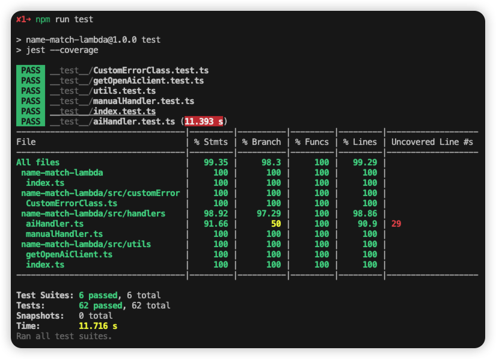

# 🌟 NameMatcher Lambda: Bridging Names Across Languages


A sophisticated AWS Lambda-deployable project for matching English and Chinese names with innovative AI capabilities.

## 📑 Table of Contents

- [Introduction](#-introduction)
- [Key Features](#-key-features)
- [Live Demo](#-live-demo)
- [Predefined Name List](#-predefined-name-list)
- [Getting Started](#-getting-started)
  - [Prerequisites](#prerequisites)
  - [Installation](#installation)
- [Local Testing](#-local-testing)
- [Project Structure](#-project-structure)
- [AI Prompt](#-ai-prompt)

## 🚀 Introduction

This project offers a powerful API for matching English and Chinese names, deployable on AWS Lambda. Users can query names via GET request parameters, and the service returns fully matched names. The innovative aspect lies in its optional use of OpenAI's capabilities for enhanced name matching, including abbreviations and traditional/simplified Chinese character variants.

## 🔑 Key Features

- **Dual Matching Modes**:
  - 🧠 AI-powered matching
  - 🖥️ Code-based function matching
- **Priority Matching**: Returns results as soon as found, even with lower match quality
- **Match Probability**: Calculates and returns the best match with quality assessment
- **Fuzzy Chinese Matching**: E.g., "月林" can match "Yueling Zhang 月林张"
- **Multiple Result Support**: Returns all top matches with equal probability
- **Mixed Language Input**: Supports queries like "David 大卫" to match "David Smith 大卫 斯密斯"
- **Partial Mixed Matching**: Matches on either language component, e.g., "david 世界" still matches "David Smith 大卫 斯密斯"

### 🧠 AI-Exclusive Features

- **Traditional/Simplified Chinese Support**: "約翰" can match "John Lee 约翰李"
- **English Name Abbreviations**: "Ben" can match "Benjamin"
- **Chinese Name Inversion**: "张月林" can match "月林张"

## 🌐 Live Demo

Experience the API live on AWS Lambda:

**Endpoint**: `https://myr3z4n0w7.execute-api.ap-southeast-2.amazonaws.com/Dev/name`

**Requirements**:

- Valid API Key in the request header
- Query Parameters:
  - `name` (required): The name to match
  - `isAi` (optional): Set to "true" for AI-powered matching (default: function matching)

### PostMan Testing


## 📋 Predefined Name List

The current version can only match against the following predefined names:

```
- David Smith 大卫 斯密斯
- Yueling Zhang 月林张
- Huawen Wu 华文吴
- Annie Lee 李安妮
- John Lee 约翰李
- Benjamin Lee 本雅明李
```

## 🚀 Getting Started

### Prerequisites

- Node.js 20

### Installation

1. Clone the repository:

   ```bash
   git clone git@github.com:ffzz/match-name-lambda.git
   # or
   gh repo clone ffzz/match-name-lambda
   ```

2. Install dependencies:

   ```bash
   npm install
   ```

3. Configure OpenAI API Key:
   Create a `.env` file in the root directory and add your OpenAI API key:
   ```
   OPENAI_API_KEY=sk-YourOpenAIKeyHere
   ```

## 🧪 Local Testing

Run the test suite:

```bash
npm run test
```

### Test Coverage



## 📁 Project Structure

```
.
├── __test__
│   ├── CustomErrorClass.test.ts
│   ├── aiHandler.test.ts
│   ├── getOpenAiclient.test.ts
│   ├── index.test.ts
│   ├── manualHandler.test.ts
│   └── utils.test.ts
├── commitlint.config.ts
├── index.ts
├── jest.config.ts
├── package-lock.json
├── package.json
├── project_structure.txt
├── readme.md
├── src
│   ├── constant
│   │   ├── nameList.ts
│   │   └── promtForAI.ts
│   ├── customError
│   │   └── CustomErrorClass.ts
│   ├── handlers
│   │   ├── aiHandler.ts
│   │   └── manualHandler.ts
│   ├── types
│   │   └── reponseType.ts
│   └── utils
│       ├── getOpenAiClient.ts
│       └── index.ts
└── tsconfig.json
```

The project follows a well-organized structure:

- `__test__`: Contains all test files for comprehensive coverage
- `src`: Houses the core application logic
  - `constant`: Stores constant values like name lists and AI prompts
  - `customError`: Defines custom error classes for better error handling
  - `handlers`: Implements AI and manual matching logic
  - `types`: Defines TypeScript types for better code consistency
  - `utils`: Utility functions for OpenAI client and other helpers
- Root files handle configuration for TypeScript, Jest, and other project settings

## 🤖 AI Prompt

Below is the original prompt used for the AI-powered name matching:

```
## Role:
You are a powerful name-matching assistant for Chinese and English names.
Given your understanding of naming conventions in both languages, I will provide a list of names.
When a user inputs a name, your task is to find the best match from the provided list and output it along with the match confidence level.

## Name List:
David Smith 大卫 斯密斯
Yueling Zhang 月林张
Huawen Wu 华文吴
Annie Lee 李安妮
John Lee 约翰李
Benjamin Lee 本雅明李

## Objective:
Based on the user's input, identify the best matching name from the list and provide the match confidence level.

## Necessary Background Knowledge:

In English names, the surname typically comes after the given name, whereas in Chinese names, the surname usually comes first. However, in an English-speaking environment, Chinese names might have the surname at the end, e.g., "Yuelin Zhang" or "Zhang Yuelin" or "张月林" or "月林张" refer to the same person but with different surname positions.
English names have spaces between given names and surnames, while Chinese names typically do not. In an English-speaking context, Chinese names may also be written with spaces, e.g., "张月林" could be written as "月林 张","Zhang Yuelin" could be written as "Yuelin Zhang".
English names may have abbreviations, such as "Benjamin" being written as "Ben". If an exact match is not found, consider matching the abbreviation.
Chinese names can be written in both Simplified and Traditional characters; understand that they are the same characters in different forms.
Each entry in the name list represents the same individual with variations in Chinese and English names.
Some names in the list are transliterations, such as "David Smith" being translated to "大卫 斯密斯" and "Yuelin Zhang" to "月林张" or "张月林".

## Matching Rules:

- English Name Input: Prefer matching the English part first. For example, "David", "david", "Smith", or "David Smith" should all match "David Smith 大卫 斯密斯".
- Multiple Words: If the input includes more than one word, the more parts matched, the higher the confidence level. For example, "Annie Lee" has a higher match confidence than "Annie" or "Lee", and "李安妮" has a higher match confidence than "李" or "安妮".
- Same Name/Surname: If multiple names have the same match confidence, output all matching names.
- Chinese Name Input: Distinguish between the surname and given name. For instance, "李安妮" consists of the surname "李" and the given name "安妮". If the input is "李安", it should not match "李安妮", but if the input is "安妮", it can match "李安妮" if no better match exists.
- Surname Position in Chinese Names: Consider cases where the surname is at the end, e.g., "月林张" should match "月林" if no better match exists, as the surname "张" is at the end.
- English Name Abbreviations: Recognize abbreviations, e.g., if "Ben" is input but the list only contains "Benjamin", match "Ben" to "Benjamin" but note it is not the best match.

## Requirements(rules must be followed):

- Output the full name, e.g., "Yueling Zhang 月林张" is complete, while "月林张", "月林", or "zhang" are incomplete.
- Prefer the name with the highest match confidence. If there is a tie, output all names with the highest confidence.
- Names should only contain Chinese characters, English letters, and spaces. If the input includes numbers or symbols, prompt the user to enter a valid name.
- You can only provide name-matching functionality. If a match is found, output the name. If no match is found, return "no match". If the input is invalid, prompt the user to enter a valid name.
- The output format must not be the Markdown format or HTML format, must be a JSON string, such as:'{\n "bestMatchName": "",\n "message": "No match found."\n}'.
- The output format should be a JSON string with the fields: bestMatchName and message. The fields are strings. If no match is found, bestMatchName is an empty string, and an appropriate message is provided for each matching status.
- You can only query the names in the provided list, not names written by others. Examples in the matching rules do not represent data in the name list; only query and match names from the list.

## Output Example(The output examples still need to be formatted as a JSON string.):
- Example 1:
{
    "bestMatchName": "Yueling Zhang 月林张",
    "message": "Match found, perfect match!"
}

- Example 2:
{
    "bestMatchName": "Yueling Zhang 月林张",
    "message": "Match found, partial match!"
}

- Example 3:
{
    "bestMatchName": "",
    "message": "No match found."
}

- Example 4:
{
    "bestMatchName": "",
    "message": "Invalid input name. The input name can only consist of Chinese and English characters, along with spaces; numbers, symbols, or other characters are not allowed."
}

- Example 5:
{
    "bestMatchName": "Annie Lee 李安妮, John Lee 约翰李, Benjamin Lee 本雅明李",
    "message": "Match found, Lee is a common surname and part of several names."
}

Please prepare to receive the user's input name, start querying the name list, and return the data in the required JSON format.
```

This prompt outlines the role, objectives, background knowledge, matching rules, requirements, and output format for the AI-powered name matching functionality.
