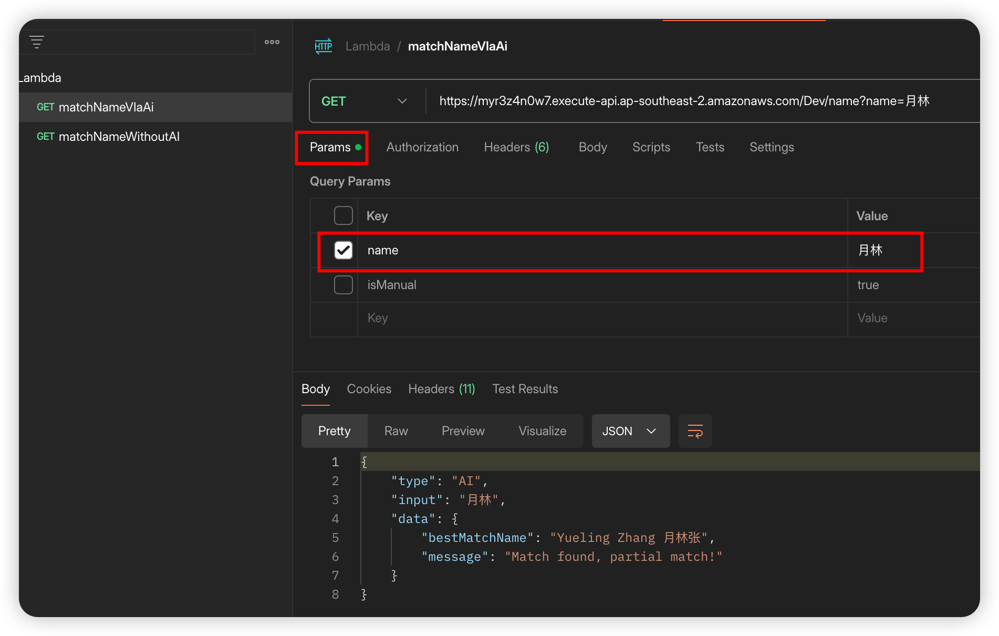

# 🌟 NameMatcher Lambda: Bridging Names Across Languages


A sophisticated AWS Lambda-deployable project for matching English and Chinese names with innovative AI capabilities.

## 📑 Table of Contents

- [Introduction](#-introduction)
- [Key Features](#-key-features)
- [Live Demo](#-live-demo)
- [Predefined Name List](#-predefined-name-list)
- [Getting Started](#-getting-started)
  - [Prerequisites](#prerequisites)
  - [Installation](#installation)
- [Local Testing](#-local-testing)
- [Project Structure](#-project-structure)

## 🚀 Introduction

This project offers a powerful API for matching English and Chinese names, deployable on AWS Lambda. Users can query names via GET request parameters, and the service returns fully matched names. The innovative aspect lies in its optional use of OpenAI's capabilities for enhanced name matching, including abbreviations and traditional/simplified Chinese character variants.

## 🔑 Key Features

- **Dual Matching Modes**:
  - 🧠 AI-powered matching
  - 🖥️ Code-based function matching
- **Priority Matching**: Returns results as soon as found, even with lower match quality
- **Match Probability**: Calculates and returns the best match with quality assessment
- **Fuzzy Chinese Matching**: E.g., "月林" can match "Yueling Zhang 月林张"
- **Multiple Result Support**: Returns all top matches with equal probability
- **Mixed Language Input**: Supports queries like "David 大卫" to match "David Smith 大卫 斯密斯"
- **Partial Mixed Matching**: Matches on either language component, e.g., "david 世界" still matches "David Smith 大卫 斯密斯"

### 🧠 AI-Exclusive Features

- **Traditional/Simplified Chinese Support**: "約翰" can match "John Lee 约翰李"
- **English Name Abbreviations**: "Ben" can match "Benjamin"
- **Chinese Name Inversion**: "张月林" can match "月林张"

## 🌐 Live Demo

Experience the API live on AWS Lambda:

**Endpoint**: `https://myr3z4n0w7.execute-api.ap-southeast-2.amazonaws.com/Dev/name`

**Requirements**:

- Valid API Key in the request header
- Query Parameters:
  - `name` (required): The name to match
  - `isAi` (optional): Set to "true" for AI-powered matching (default: function matching)

### PostMan Testing




## 📋 Predefined Name List

The current version can only match against the following predefined names:

```
- David Smith 大卫 斯密斯
- Yueling Zhang 月林张
- Huawen Wu 华文吴
- Annie Lee 李安妮
- John Lee 约翰李
- Benjamin Lee 本雅明李
```

## 🚀 Getting Started

### Prerequisites

- Node.js 20

### Installation

1. Clone the repository:

   ```bash
   git clone git@github.com:ffzz/match-name-lambda.git
   # or
   gh repo clone ffzz/match-name-lambda
   ```

2. Install dependencies:

   ```bash
   npm install
   ```

3. Configure OpenAI API Key:
   Create a `.env` file in the root directory and add your OpenAI API key:
   ```
   OPENAI_API_KEY=sk-YourOpenAIKeyHere
   ```

## 🧪 Local Testing

Run the test suite:

```bash
npm run test
```

### Test Coverage


## 📁 Project Structure

```
.
├── __test__
│   ├── CustomErrorClass.test.ts
│   ├── aiHandler.test.ts
│   ├── getOpenAiclient.test.ts
│   ├── index.test.ts
│   ├── manualHandler.test.ts
│   └── utils.test.ts
├── commitlint.config.ts
├── index.ts
├── jest.config.ts
├── package-lock.json
├── package.json
├── project_structure.txt
├── readme.md
├── src
│   ├── constant
│   │   ├── nameList.ts
│   │   └── promtForAI.ts
│   ├── customError
│   │   └── CustomErrorClass.ts
│   ├── handlers
│   │   ├── aiHandler.ts
│   │   └── manualHandler.ts
│   ├── types
│   │   └── reponseType.ts
│   └── utils
│       ├── getOpenAiClient.ts
│       └── index.ts
└── tsconfig.json
```

The project follows a well-organized structure:

- `__test__`: Contains all test files for comprehensive coverage
- `src`: Houses the core application logic
  - `constant`: Stores constant values like name lists and AI prompts
  - `customError`: Defines custom error classes for better error handling
  - `handlers`: Implements AI and manual matching logic
  - `types`: Defines TypeScript types for better code consistency
  - `utils`: Utility functions for OpenAI client and other helpers
- Root files handle configuration for TypeScript, Jest, and other project settings
